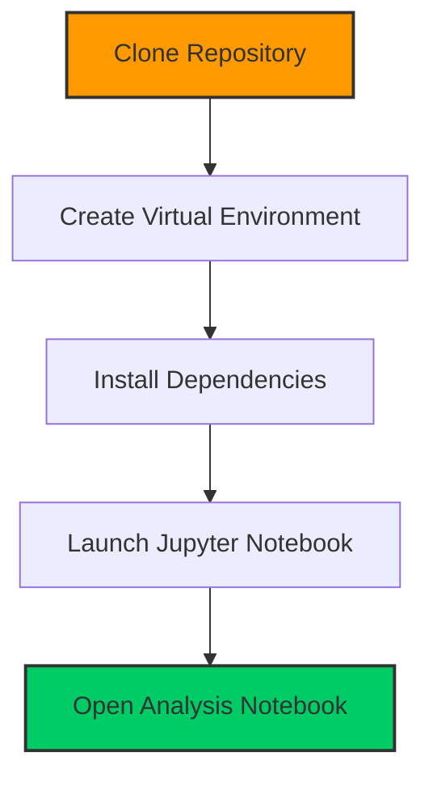
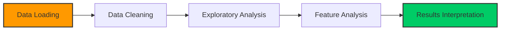

# 🎮 FIFA 2019 Players Performance Analysis

<div align="center">
  


</div>


## 📊 Project Overview

This project provides a comprehensive analysis of FIFA 2019 player data, exploring various performance metrics, player attributes, and statistical insights. The analysis leverages data visualization techniques to uncover patterns and relationships within the dataset, offering valuable insights for football enthusiasts, data analysts, and sports professionals.

The dataset contains detailed information on over 18,000 players with 89 different attributes, including physical characteristics, technical abilities, and contract details. Through this analysis, we explore player distributions, performance metrics, and potential correlations between different attributes.

<div align="center">
  
| Project Type | Dataset Size | Features | Analysis Tools |
|:------------:|:------------:|:--------:|:-------------:|
| Data Analysis | 18,207 players | 89 attributes | Python, Pandas, Matplotlib |
| Sports Analytics | 12.4+ MB | Player Statistics | Seaborn, Plotly, NumPy |

</div>

## 🎯 Key Features

This project delivers an in-depth exploration of FIFA 2019 player data with several powerful features. The analysis provides comprehensive player attribute examination, allowing users to understand the distribution and relationships between various skills and abilities. Performance comparisons across different positions and clubs reveal interesting patterns about team composition and player specialization. 

Statistical distributions of player skills help identify what makes top players stand out from the rest. Through visual representation using various charts and plots, complex data becomes accessible and intuitive. The project also identifies top performers in different categories, making it easy to spot exceptional talent across various metrics.

## 🛠️ Technologies Used

<div align="center">
  
| Technology | Purpose | Version |
|:----------:|:-------:|:-------:|
|  Python | Core programming language | 3.10 |
|  Pandas | Data manipulation and analysis | Latest |
|  NumPy | Numerical computing | Latest |
|  Matplotlib | Data visualization | Latest |
|  Seaborn | Statistical data visualization | Latest |
|  Plotly | Interactive visualizations | Latest |
|  Jupyter | Development environment | Latest |

</div>

## 📋 Dataset Description

The FIFA 2019 dataset (`data-1.csv`) contains comprehensive information about players, including:

<details>
<summary><b>Click to expand dataset details</b></summary>

### Player Information Categories:

- **Basic Information**: 
  - ID, Name, Age, Nationality, Photo URL, Flag URL
  
- **Physical Attributes**: 
  - Height, Weight, Body Type
  
- **Technical Skills**: 
  - Dribbling, Finishing, Passing, Ball Control, etc.
  
- **Performance Metrics**: 
  - Overall Rating, Potential, Special Abilities
  
- **Contract Details**: 
  - Club, Value, Wage, Release Clause, Contract Valid Until
  
- **Position Ratings**: 
  - Ratings for various playing positions (LW, ST, CAM, etc.)

</details>

The dataset includes 18,207 players with 89 different attributes, providing a rich source for analysis and insights. The data is structured in a tabular format with a mix of numerical and categorical variables, making it ideal for various analytical approaches.

## 🚀 Installation

<div align="center">
  


</div>

To run this project locally, follow these steps:

1. Clone the repository:
   ```bash
   git clone https://github.com/yourusername/fifa-2019-players-performance.git
   cd fifa-2019-players-performance
   ```

2. Create and activate a virtual environment (optional but recommended):
   ```bash
   python -m venv venv
   source venv/bin/activate  # On Windows: venv\Scripts\activate
   ```

3. Install the required dependencies:
   ```bash
   pip install pandas numpy matplotlib seaborn plotly ipywidgets missingno
   ```

4. Launch Jupyter Notebook:
   ```bash
   jupyter notebook
   ```

5. Open the `player-performance-analysis.ipynb` notebook to view and run the analysis.

## 📈 Usage Examples

### Loading and Exploring the Dataset

```python
import pandas as pd
import numpy as np
import matplotlib.pyplot as plt
import seaborn as sns
import plotly.express as ex

# Set visualization style
plt.style.use('dark_background')

# Load the dataset
data = pd.read_csv('data-1.csv')

# Display basic information
data.head()
data.info()
data.describe()
```

### Visualizing Player Distributions

```python
# Plot distribution of player ages
plt.figure(figsize=(10, 6))
sns.histplot(data['Age'], bins=20, kde=True)
plt.title('Distribution of Player Ages', fontsize=16)
plt.xlabel('Age', fontsize=12)
plt.ylabel('Count', fontsize=12)
plt.grid(alpha=0.3)
plt.show()

# Compare overall ratings by position
plt.figure(figsize=(12, 8))
sns.boxplot(x='Position', y='Overall', data=data)
plt.title('Overall Ratings by Position', fontsize=16)
plt.xticks(rotation=90)
plt.grid(alpha=0.3)
plt.show()
```

### Analyzing Top Players

```python
# Display top 10 players by overall rating
top_players = data.sort_values('Overall', ascending=False).head(10)
top_players[['Name', 'Age', 'Nationality', 'Club', 'Overall', 'Potential']]

# Create a bar chart of top players
plt.figure(figsize=(12, 6))
ax = sns.barplot(x='Name', y='Overall', data=top_players, palette='viridis')
plt.title('Top 10 Players by Overall Rating', fontsize=16)
plt.xticks(rotation=45, ha='right')
plt.tight_layout()

# Add value labels on top of bars
for i, v in enumerate(top_players['Overall']):
    ax.text(i, v+0.5, str(v), ha='center', fontsize=10)

plt.show()
```


## 📝 Analysis Workflow

The analysis follows a structured approach to extract meaningful insights from the FIFA 2019 player dataset. Initially, we load and explore the data to understand its structure, checking for missing values and examining the distribution of key variables. This exploration phase is crucial for identifying potential issues and opportunities in the dataset.

Next, we clean and preprocess the data, handling missing values and converting data types as needed. This ensures that our analysis is based on accurate and consistent information. With clean data in hand, we proceed to exploratory data analysis, investigating relationships between variables and identifying patterns through statistical methods and visualizations.

We then conduct feature-specific analysis, examining player attributes, positions, and clubs in detail to uncover interesting trends and comparisons. This targeted approach allows us to focus on specific aspects of player performance and characteristics. Finally, we interpret the results, drawing conclusions from our analysis and presenting findings in a clear, visual manner that makes complex data accessible and actionable.

<div align="center">
  


</div>

## 🔍 Key Insights

Through this analysis, we uncover several fascinating insights about FIFA 2019 players. The distribution of player attributes across different positions reveals how certain skills are prioritized based on playing roles. For example, strikers typically have higher finishing and shooting attributes, while defenders excel in tackling and marking.

We also explore the correlation between player age, potential, and overall rating, showing how performance typically peaks at certain ages and declines thereafter. The comparison of player values across different leagues and nationalities highlights interesting economic patterns in the football market, with some leagues commanding premium valuations.

The analysis identifies undervalued players with high potential, providing valuable information for talent scouts and team managers. Additionally, we examine physical attributes and their relationship to player performance, revealing how factors like height, weight, and body type influence different aspects of the game.

## 🤝 Contributing

Contributions to this project are welcome! To contribute:

1. Fork the repository
2. Create a new branch (`git checkout -b feature/your-feature`)
3. Make your changes
4. Commit your changes (`git commit -m 'Add some feature'`)
5. Push to the branch (`git push origin feature/your-feature`)
6. Open a Pull Request

<div align="center">
  
| Contribution Type | Guidelines |
|:----------------:|:----------:|
| Bug Reports | Include steps to reproduce and expected behavior |
| Feature Requests | Describe the feature and its benefits |
| Code Contributions | Follow PEP 8 style guide and include tests |
| Documentation | Ensure clarity and completeness |

</div>

## 📄 License

This project is licensed under the MIT License - see the LICENSE file for details.


<div align="center">
  <p><b>🎮 FIFA 2019 Players Performance Analysis</b></p>
  <p><i>Unlocking insights from the beautiful game</i></p>
  
  
  
  
</div>
